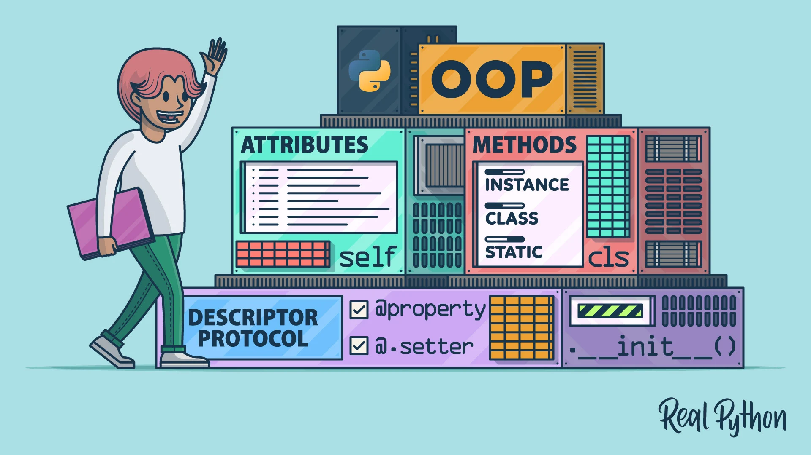
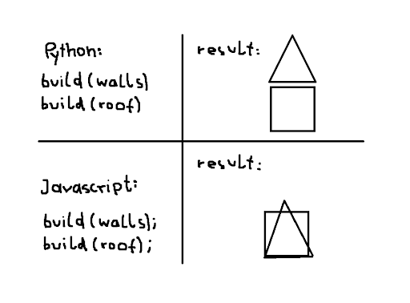
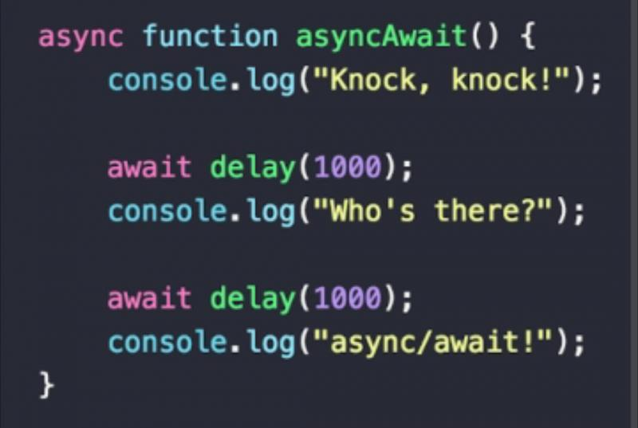
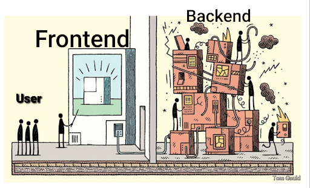
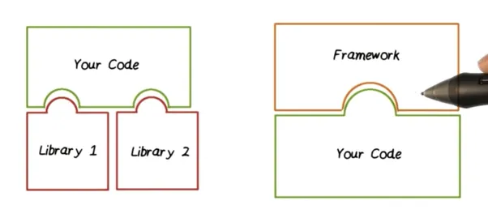
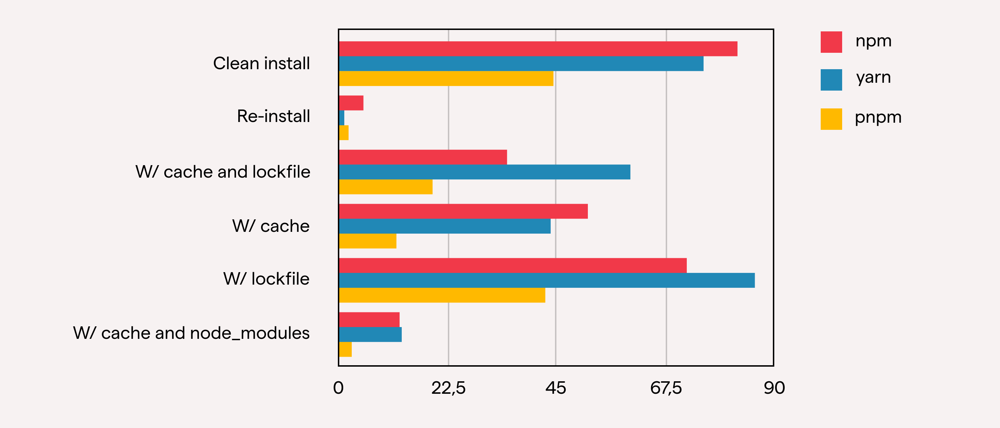

# Pengantar Frontend **Developer**

- [Pengantar Frontend Developer](#pengantar-frontend-developer)
  - [Kenapa Memilih Frontend?](#kenapa-memilih-frontend)
  - [Peluang Karir & Jejak Alumni ITS](#-peluang-karir--jejak-alumni-its)
  - [Apa aja sih yang harus dikuasai?](#️-apa-aja-sih-yang-harus-dikuasai)
  - [Apakah akan terus belajar Frontend? (Evolusi Skill)](#-apakah-akan-terus-belajar-frontend-evolusi-skill)
  - [Apakah Frontend Masih Relevan? Akankah Digantikan oleh AI?](#-apakah-frontend-masih-relevan-akankah-digantikan-oleh-ai)
  - [Paradigma Frontend Developer](#paradigma-frontend-developer)
    - [Procedural Programming](#procedural-programming)
    - [Object Oriented Programming](#object-oriented-programming)
    - [Functional Programming](#functional-programming)
    - [Perbandingan Paradigma](#perbandingan-procedural-programming-vs-object-oriented-programming-vs-functional-programming)
  - [Mengenal Frontend lebih dekat](#mengenal-frontend-lebih-dekat)
    - [Fungsi dalam Frontend: Async, Sync, Callback, dan Lainnya](#fungsi-dalam-frontend-async-sync-callback-dan-lainnya)
  - [Data Object Manipulation (DOM)](#data-object-manipulation-dom)
    - [Bagaimanakah cara kerja DOM?](#bagaimanakah-cara-kerja-dom)
    - [Kelemahan Manipulasi DOM Manual](#kelemahan-manipulasi-dom-manual)
  - [Fetch API dan Axios](#fetch-api-dan-axios-mengambil-data-dari-server)
  - [Framework Frontend](#framework-frontend)
    - [Library vs Framework](#library-vs-framework)
    - [Package Manager](#package-manager)
    - [Mengenal Vite](#mengenal-vite)
  - [Styling Modern: Mengenal Tailwind CSS](#-styling-modern-mengenal-tailwind-css)
  - [Pengenalan Dasar React](#pengenalan-dasar-react)
  - [Penutup](#penutup)
  - [Referensi](#referensi)

# Pengantar Frontend Developer

## Kenapa Memilih Frontend?

Mengapa *Frontend Development* bisa jadi batu loncatan karir yang sangat menjanjikan? 

Pertama, **Frontend adalah jendela utama**. Sehebat apapun arsitektur *backend* atau sekompleks apapun *database* yang ada di belakangnya, pengguna hanya akan berinteraksi dengan apa yang ada di layar mereka. Tampilan yang menarik, responsif, dan UX (*User Experience*) yang mulus adalah penentu utama apakah sebuah produk digital akan sukses atau malah ditinggalkan.

Menjadi seorang *Frontend Developer* memang berarti kita membuat UI yang akan dirasakan oleh banyak *user*. Tapi kalau didalamin lagi, kita sebenarnya sedang melatih beberapa hal krusial:

* **Problem Solving & Empati:** Kamu belajar memahami apa yang memudahkan pengguna. Ini bikin kamu jadi *engineer* yang berpusat pada solusi, bukan sekadar penulis kode.
* **Adaptabilitas Tinggi:** Ekosistem Frontend bergerak sangat cepat. Ini menuntut kita untuk terus belajar dan beradaptasi dengan teknologi baru.
* **Sentuhan Manusia (*Craftsmanship*):** Walaupun AI sekarang makin canggih buat nulis kode atau *generate* struktur dasar, sentuhan *craftsmanship* untuk bikin animasi yang pas, aksesibilitas yang baik, dan *feel* aplikasi yang nyaman masih sangat membutuhkan insting manusia.

Nah, itu adalah beberapa *skill set* dasar yang mungkin kalau misalnya nanti kamu nggak jadi *frontend developer* pun, bakal tetap kepakai di bidang lainnya.

---

## 🚀 Peluang Karir & Jejak Alumni ITS

Banyak yang nanya, *"Kalau fokus di Frontend, jenjang karirnya ke mana sih?"* Dilansir dari berbagai *tech blog* dan standar industri, karir seorang *Frontend Engineer* umumnya punya tahapan kayak gini:

* **Junior Frontend Developer:** Fokus pada eksekusi tugas, menerjemahkan desain (Figma) menjadi komponen kode, dan *bug fixing*.
* **Middle Frontend Developer:** Mulai memikirkan optimasi, memimpin fitur tertentu, dan membimbing *junior*.
* **Senior Frontend Developer:** Merancang arsitektur aplikasi di sisi klien, memikirkan performa, keamanan, dan standar *engineering* tim.
* **Frontend Software Architect:** Menentukan *tech stack* perusahaan, merancang *design system* lintas platform, dan menyelesaikan masalah teknikal di level bisnis.

Di lingkungan kampus kita sendiri, udah banyak *kating* dan alumni Informatika ITS yang sukses ngebangun karir mantap di bidang Frontend. Beberapa di antaranya:

* Lathifa Itqonina Mardiyati (Teknik Informatika 2019)
* Rizqi Tsani (Teknik Informatika 2019)
* Benedictus Wicaksono (Teknik Informatika 2020)
* Muhammad Dzikri Syairozi (Teknik Informatika 2020)
* Muhammad Yunus (Teknik Informatika 2020)
* Frederick Hidayat (Teknik Informatika 2021)
* Gabriella Natasya Br. Ginting (Teknik Informatika 2021)
* Robby Ulung Pambudi (Teknik Informatika 2021)
* Ainun Nadhifah Syamsiyah (Teknik Informatika 2022)
* Farrell Matthew Lim (Teknik Informatika 2022)
* Reynaldi Neo Ramadhani (Teknik Informatika 2022)
* Andrew Wallace (Teknik Informatika 2023)
* Paiz (Teknik Informatika 2023)
* Aldin (Teknik Informatika 2023)
* Nicholas (Teknik Informatika 2023)

Jejak mereka ngebuktiin kalau fondasi yang kalian bangun di bangku kuliah, kalau ditekuni, bisa ngebawa kalian ke industri teknologi terdepan. Jadi, jangan ragu buat totalitas di sini!

---

## 🛠️ Apa aja sih yang harus dikuasai?

Untuk menjadi seorang *frontend developer*, ada beberapa teknologi wajib yang harus dikuasai:

* **HTML**
* **CSS**
* **JavaScript**
* **Framework** (React, Angular, Vue, dll.)
* **Version Control** (Git)

Yang tentunya, teman-teman sudah pelajari dasar-dasarnya di mata kuliah Pemrograman Web.

---

## 📈 Apakah akan terus belajar Frontend? (Evolusi Skill)

Pas awal-awal mulai mendalami Frontend, mungkin kalian bakal ngerasa *overwhelmed* (kewalahan) sama banyaknya hal yang harus dipelajari. Mulai dari CSS, Framework, State Management, sampai Build Tools.

Biar nggak bingung arah, kita perlu kenalan sama konsep bentuk profil *developer*. Evolusinya kira-kira dari **I, T, N, lalu M**:

* **1. I-Shaped (Sang Spesialis Murni)** Ini adalah *developer* yang punya pengetahuan sangat dalam di satu bidang spesifik (garis vertikal I), tapi kurang memiliki pemahaman di luar bidangnya. Misalnya, jago banget nge-React, tapi bingung kalau diajak diskusi soal cara kerja *database* atau dasar desain UI/UX.

* **2. T-Shaped (Target Awal Kita!)** Ini adalah standar emas untuk *developer* modern dan menjadi target utama kalian saat ini.
  * **Garis Horizontal (Broad Knowledge):** Paham dasar-dasar dari berbagai bidang pendukung. Tahu sedikit tentang *Backend* (cara API bekerja), paham dasar *Database*, dan mengerti prinsip dasar UI/UX.
  * **Garis Vertikal (Deep Expertise):** Punya satu spesialisasi yang dikuasai secara mendalam. Misalnya, keahlian utamamu adalah *Frontend Web Development* (menguasai ekosistem React, manipulasi DOM, manajemen *state* kompleks, dan optimasi performa web).
  
  > **Kenapa harus T-Shaped?** Karena di dunia kerja nyata, kamu nggak bekerja sendirian. Tahu sedikit tentang *Backend* bikin kamu lebih gampang diskusi sama tim *Backend*. Tahu sedikit tentang desain bikin kamu lebih sejalan dengan tim UI/UX.

* **3. N-Shaped** Kalau sudah mantap di T-Shaped, kamu bisa berevolusi nambah satu kaki keahlian vertikal lagi. Contohnya: Kamu adalah seorang *expert* di *Frontend Development* (kaki pertama) **DAN** juga *expert* di ranah UI/UX Design (kaki kedua). Kamu jadi jembatan maut antara desainer dan *programmer*.

* **4. M-Shaped / Comb-Shaped (Sang Multi-Spesialis)** Punya banyak "tiang" spesialisasi yang mendalam. Biasanya ini adalah level *Senior Fullstack Developer* atau *Tech Lead*. Jago bikin *frontend* yang interaktif, jago ngerancang arsitektur *backend* yang *scalable*, dan jago *deploy* aplikasi (DevOps).

Pada akhirnya, nggak ada yang salah mau jadi kayak gimana. Ini kan pada dasarnya sama aja kayak milih antara mau jadi spesialis atau generalis, dan itu murni pilihan. Tapi kalau untuk aku pribadi, di awal-awal mending fokus jadi **T-Shaped** dulu aja. Tau sedikit tentang bidang yang lain, tapi pastiin ada 1 bidang yang benar-benar didalemin.

## 🤖 Apakah Frontend Masih Relevan? Akankah Digantikan oleh AI?

Di era di mana alat (*tools*) AI seperti ChatGPT, GitHub Copilot, hingga v0 dari Vercel mampu membuat *layout* komponen web hanya dari sebaris *prompt* dalam hitungan detik, sangat wajar jika muncul pertanyaan: *"Apakah peran Frontend Developer akan segera mati?"* Jawabannya adalah **tidak**. Peran *Frontend* tidak akan punah, tetapi cara kita bekerja dan menulis kode yang akan mengalami perubahan drastis. Pekerjaan repetitif seperti sekadar mengetik ulang desain statis menjadi struktur HTML dan CSS murni memang perlahan akan diambil alih oleh mesin. Namun, ini bukanlah sebuah ancaman, melainkan evolusi yang justru membebaskan kita dari tugas-tugas mekanis yang membosankan.

Kenyataannya, di masa depan kita memang akan sangat banyak menggunakan AI dalam pekerjaan sehari-hari. AI akan bertindak sebagai asisten atau *copilot* yang luar biasa cepat untuk membuat kerangka dasar (*boilerplate*), menyelesaikan potongan kode, atau membantu mencari letak *error*. Alih-alih mengetik setiap baris kode dari nol, peran kita akan bergeser dari sekadar "kuli ketik" menjadi seorang "Arsitek" dan "Editor". Kita akan lebih banyak bertugas memberikan instruksi yang tepat kepada AI, meninjau hasil kodenya, dan merangkai potongan-potongan komponen tersebut menjadi satu sistem aplikasi yang utuh.

Di titik pergeseran inilah **pemahaman fundamental justru menjadi jauh lebih penting dan tidak bisa ditawar**. Bagaimana kalian bisa memvalidasi atau mengoreksi kode hasil *generate* AI jika kalian sendiri tidak memahami cara kerja DOM, konsep *state management* di React, atau hierarki CSS? Saat AI menghasilkan kode yang menyebabkan performa aplikasi melambat atau memunculkan *bug* logika yang kompleks di tahap penyelesaian akhir (*The Last 20%*), AI sering kali akan kebingungan memperbaikinya sendiri. Hanya *engineer* dengan fondasi JavaScript murni dan pemahaman arsitektur perangkat lunak yang kuatlah yang mampu masuk ke dalam kode, melakukan *debugging*, dan menyelesaikan masalah tersebut.

Lebih dari sekadar menulis baris kode, *Frontend Development* pada intinya adalah tentang memanusiakan antarmuka aplikasi. AI tidak memiliki empati untuk merasakan apakah sebuah transisi halaman terasa memusingkan, atau apakah tombol yang ada di layar terlalu sulit ditekan oleh jari pengguna. Aspek *User Experience* (UX), perancangan logika bisnis (*business logic*) yang bersinggungan langsung dengan kebutuhan klien, hingga memastikan aplikasi dapat diakses dengan baik (*accessibility*) tetap membutuhkan pemikiran analitis dan insting manusia. AI adalah alat bantu yang sangat canggih, namun kitalah yang memegang kendali penuh atas solusi dan pengalaman yang diberikan kepada pengguna.

## Paradigma Frontend Developer

Sesuai yang dijelaskan diatas bahwasanya frontend adalah sebuah “jendela pertama yang terbuka bagi pengguna saat berinteraksi dengan suatu platform digital.” Maka dalam sub bab kali ini kita akan membahas bagaimana cara mengorganisir kode secara baik dengan mengenal 3 konsep utama kita yaitu: “Prosedural Pemrograman”, “Object Oriented Programing”, “Functional Programing”

### Procedural Programing


Procedural Programing dapat didefinisikan sebagai rutinitas, subrutin, atau sebuah fungsi yang secara sederhana terdiri dari serangkaian langkah komputasi yang harus dilakukan. Setiap fungsi mewakili tugas atau tindakan spesifik yang perlu dilakukan oleh program. Fokus utama pemrograman prosedural adalah memecah logika program menjadi komponen-komponen yang dapat dikelola, dapat digunakan kembali, dan modular.

#### Karakteristik Utama PP

Karakteristik utama dari pemrograman prosedural meliputi:

1. Modularity

    Kode program dipecah menjadi fungsi atau prosedur yang lebih kecil dan masing masing bertanggung jawab untuk tugas tertentu

2. Function Call

    Prosedur atau fungsi dapat dipanggil secara berurutan. Dan sering kali fungsi mengambil sebuah parameter input dan dikembalikan sebagai hasil output

3. Global Variable

    Program prosedural sering menggunakan variabel global untuk menyimpan data yang dapat diakses oleh beberapa fungsi. Namun, penggunaan variabel global yang berlebihan dapat menyebabkan masalah seperti efek samping yang tidak diinginkan dan kesulitan dalam memahami aliran data.

4. Sequential Execution

    program dieksekusi dalam urutan linier. Pernyataan dieksekusi satu demi satu, dan struktur kontrol seperti loop dan kondisional menentukan aliran eksekusi.

5. Limited Reusability

    Penggunaan Ulang Terbatas: Meskipun fungsi meningkatkan penggunaan ulang dibandingkan dengan kode monolitik, fungsi biasanya terbatas untuk digunakan dalam program yang sama. Fungsi tidak dienkapsulasi dan dapat digunakan kembali seperti kelas dan objek dalam pemrograman berorientasi objek.

#### Contoh Kode Program Procedural

```javascript
function calculateArea(length, width) {
    return length * width;
}

function calculateVolume(length, width, height) {
    return length * width * height;
}

let area = calculateArea(10, 20);
let volume = calculateVolume(10, 20, 30);
```

Dari contoh kode diatas kita dapat melihat bahwa kode tersebut terdiri dari beberapa fungsi yang masing masing bertanggung jawab untuk tugas tertentu. Fungsi `calculateArea` bertugas untuk menghitung luas, sedangkan fungsi `calculateVolume` bertugas untuk menghitung volume. Kedua fungsi tersebut dapat dipanggil secara berurutan dan masing masing fungsi mengambil parameter input dan mengembalikan hasil output.

### Object Oriented Programing



Object-Oriented Programming (OOP) adalah paradigma pemrograman yang berfokus pada konsep "objek". Konsep ini memungkinkan programmer untuk mengorganisir dan mendesain kode mereka dengan cara yang mencerminkan atau merepresentasikan objek dalam dunia nyata. Mari kita bahas beberapa konsep dasar OOP dengan cara yang mudah dipahami:

#### Karakteristik Utama OOP

1. **Object**

    - Objek adalah entitas yang memiliki atribut (data) dan metode (fungsi) yang dapat dijalankan.
    - Contoh: Jika kita berbicara tentang mobil, objeknya bisa menjadi "Mobil BMW X3" dengan atribut seperti warna, kecepatan, dan metode seperti "hidupkan mesin".

2. **Class**

    - Kelas adalah cetak biru atau blueprint untuk membuat objek.
    - Contoh: Jika "Mobil BMW X3" adalah objek, maka "Mobil" adalah kelas yang mendefinisikan bagaimana objek mobil harus dibuat dan memiliki atribut/metode apa.

3. **Atribut**

    - Atribut adalah karakteristik atau data yang dimiliki oleh objek.
    - Contoh: Dalam kelas "Mobil", atributnya bisa menjadi "warna", "kecepatan", dan lainnya.

4. **Metode**

    - Metode adalah fungsi atau tindakan yang dapat dilakukan oleh objek.
    - Contoh: Dalam kelas "Mobil", metodenya bisa menjadi "hidupkanMesin()", "matikanMesin()", atau "percepat()".

5. **Inheritance (Pewarisan)**

    - Pewarisan memungkinkan kelas baru ("subclass" atau "child class") untuk mewarisi atribut dan metode dari kelas yang sudah ada ("superclass" atau "parent class").
    - Contoh: Jika ada kelas "Truk" dan kelas "Mobil" sebagai superclass, maka "Truk" dapat mewarisi atribut dan metode dari "Mobil".

6. **Polimorfisme**

    - Polimorfisme memungkinkan objek dari kelas yang berbeda untuk merespons metode dengan cara yang sama.
    - Contoh: Metode "bersuara()" dapat digunakan baik oleh objek "Anjing" maupun "Kucing", dan keduanya mengeluarkan suara yang berbeda.

7. **Enkapsulasi**
    - Enkapsulasi melibatkan penyembunyian detail implementasi dari dunia luar dan membatasi akses langsung ke beberapa bagian dari objek.
    - Contoh: Dengan menggunakan enkapsulasi, kita dapat membatasi akses langsung ke atribut seperti "saldoBank" dalam objek "RekeningBank".

Tentunya hal-hal diatas sudah tidak asing lagi bagi kalian karena sudah pernah dipelajari di kelas `Pemrograman Berbasis Kerangka Kerja`.

OOP sendiri masih dipakai di library yang sangat terkenal bagi kita yaitu “React JS” namun penggunaan Object Oriented sendiri sudah tidak direkomendasikan oleh tim dari React JS dan lebih menyarankan menggunakan Functional Programing.

### Functional Programing

**Pemrograman fungsional** (FP) merupakan paradigma pemrograman deklaratif yang berfokus pada pendefinisian dan komposisi fungsi untuk menyelesaikan masalah komputasi. Alih-alih berfokus pada mutasi state program, FP menekankan pada evaluasi ekspresi dan transformasi data melalui fungsi-fungsi murni.

#### Karakteristik Utama FP

1. **Fungsi sebagai Warga Kelas Satu**:

    - Fungsi bukan hanya subrutin, tetapi entitas yang dapat dimanipulasi seperti data.
    - Fungsi dapat diteruskan sebagai argumen, dikembalikan sebagai nilai, dan diikat ke variabel.

2. **Imutabilitas**

    - Data dalam program fungsional tidak dapat diubah setelah diinisialisasi.
    - Hal ini meningkatkan prediktabilitas dan memudahkan debugging.

3. **Rekursi**

    - Fungsi dapat memanggil diri sendiri untuk memecah masalah kompleks menjadi sub-masalah yang lebih kecil.
    - Rekursi memungkinkan solusi elegan untuk masalah seperti perhitungan faktorial dan traversal struktur data.

4. **Komposisi Fungsi**
    - Fungsi-fungsi kecil dapat digabungkan untuk membentuk fungsi yang lebih kompleks.
    - Komposisi fungsi meningkatkan modularitas dan keterbacaan kode.

#### Contoh Kode Program Functional

```typescript
// Fungsi murni untuk menghitung total penjualan
const totalPenjualan = (
    produkList: { harga: number; jumlah: number }[]
): number => {
    return produkList.reduce(
        (total, produk) => total + produk.harga * produk.jumlah,
        0
    );
};

// Contoh penggunaan
const produkList = [
    { harga: 10, jumlah: 2 },
    { harga: 5, jumlah: 3 },
];

const total = totalPenjualan(produkList);
console.log(`Total penjualan: ${total}`); // Output: Total penjualan: 35
```

### Perbandingan Procedural Programing Vs Object Oriented Programing Vs Functional Programing

|      Fitur       |          Procedural Programming          |       Object-Oriented Programming        |               Functional Programming               |     |
| :--------------: | :--------------------------------------: | :--------------------------------------: | :------------------------------------------------: | --- |
| Paradigma Utama  |          Urutan langkah-langkah          |          Objek dan interaksinya          |            Fungsi dan transformasi data            |     |
|     Struktur     |           Prosedur dan fungsi            |             Kelas dan Objek              |                    Fungsi murni                    |     |
|      State       |                 Mutable                  |           Mutable dalam objek            |                     Immutable                      |     |
|   Fokus Utama    | Memecahkan masalah dengan urutan langkah |   Mendefinisikan entitas dan perilaku    |           Transformasi data tanpa mutasi           |     |
|   Konsep Utama   |     Fungsi, variabel, struktur data      | Kelas, objek, inheritance, encapsulation | Fungsi murni, immutability, higher-order functions |     |
|    Keuntungan    |      Mudah dipahami dan dipelajari       |     Modularitas dan reusability kode     |         Kode mudah diuji dan diverifikasi          |     |
|    Kekurangan    |       Kurang modular dan reusable        |     Kompleksitas untuk proyek besar      |       Kurang familiar bagi banyak programmer       |     |
|  Contoh Bahasa   |            C, Fortran, BASIC             |         Java, C++, Python (OOP)          |            Haskell, Erlang, Elm, Scala             |     |
| Aplikasi Terbaik |        Proyek kecil dan sederhana        |   Sistem kompleks, aplikasi enterprise   |        Sistem real-time, pemrosesan paralel        |     |

Dari tabel diatas kita dapat melihat perbandingan antara Procedural Programing, Object Oriented Programing, dan Functional Programing. Masing masing paradigma memiliki kelebihan dan kekurangan tersendiri. Pemilihan paradigma yang tepat tergantung pada kebutuhan dan karakteristik proyek yang sedang dikerjakan.

---

## Mengenal Frontend lebih dekat

Setelah kita mengetahui dasar - dasar dari pengembangan web, maka pada kesempatan kali ini kita akan mempelajari lebih lanjut mengenai Frontend secara teknis yang mencakup pengenalan fungsi dan pengenalan DOM secara matang sebelum lanjut ke dalam Framework.

### Fungsi dalam Frontend: Async, Sync, Callback, dan Lainnya



Fungsi adalah alat penting dalam pengembangan perangkat lunak. Mereka membantu membuat kode lebih terstruktur, modular, reusable, dan mudah diuji. Memahami cara kerja dan jenis-jenis fungsi sangat penting bagi programmer untuk menulis kode yang berkualitas dan efisien.

#### Fungsi Sinkron (Synchronous Function)

Synchronous Function merupakan sebuah fungsi yang setiap prosesnya diselesaikan terlebih dahulu sebelum lanjut ke dalam fungsi berikutnya.

Bayangkan kita sedang memasak makanan. Setiap langkah dalam resep harus diselesaikan secara berurutan. kita tidak bisa memulai langkah berikutnya sampai langkah sebelumnya selesai.

Dalam Frontend Developer Fungsi sinkron ideal untuk tugas-tugas sederhana yang tidak memerlukan waktu lama untuk dijalankan, seperti:

-   Manipulasi data lokal
-   Perhitungan sederhana
-   Pengambilan keputusan berdasarkan data yang sudah tersedia

```typescript
function addNumbers(a, b) {
    // Penjumlahan dua angka
    return a + b;
}
const result = addNumbers(5, 3);
console.log(result); // Output: 8
```

Dalam contoh ini, fungsi addNumbers dijalankan secara sinkron. Kode di dalam fungsi dijalankan baris demi baris. Pertama, nilai a dan b ditambahkan. Kemudian, hasilnya dikembalikan dan disimpan dalam variabel result. Terakhir, nilai result dicetak ke konsol.

#### Fungsi Asinkron (Asynchronous Function)



Sebagai kelanjutan dari pembahasan fungsi sinkron, mari kita dalami fungsi asinkron dalam frontend.

Sekarang bayangkan kita sedang memasak sebuah pizza. Kita dapat memasukkan pizza ke oven (operasi asinkron yang memerlukan waktu) dan sambil menunggu, kita dapat mencuci piring (melakukan tugas lain tanpa terpaku pada pizza).

Dalam Programer Fungsi asinkron adalah blok kode yang tidak dijalankan secara berurutan melainkan melakukan operasi secara non-blocking. Artinya, program utama tidak menunggu fungsi asinkron selesai sebelum melanjutkan ke baris kode berikutnya.

Fungsi asinkron dapat dieksekusi di latar belakang sambil program utama menjalankan bagian lain seperti dengan analogi diatas.

Penggunaan asinkron function dapat meningkatkan performa dari aplikasi yang akan kita buat. Fungsi ini sangatlah penting dalam pengembangan.

Penggunaan asinkron function dapat meningkatkan performa dari aplikasi yang akan kita buat. Fungsi ini sangatlah penting dalam pengembangan Frontend Developer yang merupakan pasukan terdepan dikarenakan tugas kita adalah menyajikan tampilan secara tepat walaupun di belakang layar proses tersebut berjalan tidak semestinya.



Setelah kita mengerti dan memahami konsep dari Asinkron function selanjutnya adalah mulai mengenal dengan mempraktekkan secara langsung. Mari kita mulai dengan menggunakan case study yang sederhana.

Budi ingin membuat sebuah program yang menampilkan daftar nama 5 orang secara berurutan dengan delay 1 detik di antara setiap nama, dan kata hallo pada detik ke 2.

```typescript
const names = ["Andi", "Budi", "Cici", "Doni", "Eko"];
function displayNames() {
    for (let i = 0; i < names.length; i++) {
        setTimeout(() => {
            console.log(names[i]);
        }, i * 1000);
    }
    setTimeout(() => {
        console.log("hallo");
    }, 2000);
}

displayNames();
```

#### Fungsi Callback (Callback Function)

Bayangkan Anda meminta teman untuk membelikan sesuatu di toko. Anda tidak hanya memberi mereka uang, tetapi juga instruksi tentang apa yang harus dibeli. Instruksi ini bisa dianggap sebagai fungsi callback.

Fungsi callback adalah fungsi yang dipassed sebagai argumen ke fungsi lain dan dieksekusi ketika kondisi tertentu terpenuhi atau operasi selesai. Ini seperti memberikan instruksi tambahan yang akan dijalankan nanti oleh fungsi lain.

```typescript
function fetchData(url, callback) {
    // Lakukan fetch data dari URL
    // ...

    // Ketika data selesai diambil, panggil callback dengan data tersebut
    callback(data);
}

fetchData("https://api.example.com/data", (data) => {
    console.log(data); // Data tersedia setelah fetching selesai
});
```

**Kapan menggunakan fungsi callback?**

-   `Operasi asinkron`: Ketika Anda perlu menunggu hasil dari operasi asinkron (misalnya, fetching data dari API), Anda dapat menggunakan callback untuk menangani hasil tersebut setelah tersedia.

-   `Event handling`: Callback sering digunakan dalam event handling untuk menjalankan kode tertentu ketika event terjadi (misalnya, klik tombol).

#### Promise Function

Promise adalah sebuah objek dalam JavaScript yang merepresentasikan hasil asynchronous operation (sukses atau gagal) di masa depan. Ia menyediakan API terstruktur untuk menangani dan chaining operasi asynchronous, meningkatkan reliability dan maintainability kode.

Mari kita analogikan Promise function dengan kegiatan kita sehari - hari. Sekarang bayangkan kita sedang memesan pizza secara online. Anda tidak tahu persis kapan pizza akan tiba (operasi asynchronous). Namun, toko pizza dapat memberikan sebuah "promise" (janji) bahwa pizza akan sampai dalam waktu tertentu.

Promise ini memungkinkan Anda melanjutkan aktivitas lain sambil menunggu pizza tiba, dan Anda akan diberitahu ketika pizza sudah siap (sukses) atau terjadi masalah (gagal).

Seperti itulah analogi dari penjelasan promise function dalam kegiatan kita sehari - hari, selanjutnya seperti apa sih cara implementasi Promise Function dalam Frontend Developer:

```typescript
function fetchData(url) {
    return new Promise((resolve, reject) => {
        // Lakukan fetch data dari URL

        if (sukses) {
            resolve(data); // resolve dengan data jika sukses
        } else {
            reject(error); // reject dengan error jika gagal
        }
    });
}

fetchData("https://api.example.com/data")
    .then((data) => {
        console.log("Data diterima:", data);
    })
    .catch((error) => {
        console.error("Error:", error);
    });
```

Lalu apa bedanya dengan `.then()` dan `.catch()` kan bisa aja tuh ditaruh didalam situ tanpa harus menggunakan Promise? kalau kita lihat penjelasan diatas kita bisa tarik sebuah perbedaan bahwa promise itu hanya sebatas Janji sedangkan then dan `catch` adalah apa yang akan dilakukan ketika mendapat sebuah kegagalan atau kesuksesan dalam pemanggilan.

Kalau teman-teman masih susah untuk memahami perbedaan tersebut mari kita per muda dengan masalah ini. Anggap `pizza` yang kita pesan tadi sudah sampai. Tetapi pesanan tersebut berbeda dengan apa yang kita pesan (`Promise`). Disini kita bisa menolak (`Rejected`) pesanan tersebut dan meminta pesanan baru sesuai apa yang kita inginkan (`Catch`). Apabila kita tidak menggunakan Promise maka pesanan tersebut akan diterima sebagai Berhasil (`Then`).

Seperti itulah konsep penggunaan dari `Promise`.

#### Generator Function

Generator function adalah fungsi khusus yang menghasilkan iterator. Ia memungkinkan Anda menghentikan dan melanjutkan eksekusi kode, dan menghasilkan serangkaian nilai secara bertahap.

Generator function sangat berguna dalam menghasilkan nilai secara bertahap, seperti mengambil data dari API secara bertahap, menghasilkan angka secara bertahap, dan lainnya.

```typescript
function* generateNumbers() {
    yield 1;
    yield 2;
    yield 3;
}

const numbers = generateNumbers();
console.log(numbers.next().value); // Output: 1
console.log(numbers.next().value); // Output: 2
console.log(numbers.next().value); // Output: 3
```

#### Arrow Function

Fungsi singkat dan ringkas untuk menulis ekspresi pendek.

```typescript
const addNumbers = (a, b) => a + b;
console.log(addNumbers(5, 3)); // Output: 8
```

---

## Data Object Manipulation (DOM)


Pasti teman-teman sudah tidak asing dengan materi pembahasan kali ini yaitu DOM. Document Object Model (DOM) adalah antarmuka pemrograman yang merepresentasikan struktur dan konten halaman web sebagai pohon objek. Setiap elemen dalam kode HTML, seperti paragraf, judul, gambar, dan formulir, sesuai dengan node di pohon ini.

Dengan memanipulasi DOM, Anda dapat secara dinamis mengubah tampilan dan perilaku halaman web. Ini termasuk tugas-tugas seperti:

-   **Menambahkan atau menghapus elemen**: Anda dapat membuat elemen HTML baru dan menambahkannya ke DOM, atau menghapus elemen yang ada sepenuhnya.
-   **Mengubah konten**: Anda dapat mengubah konten teks elemen, memperbarui atribut, dan menyesuaikan gaya.
-   **Menanggapi peristiwa**: Anda dapat melampirkan pendengar peristiwa ke elemen, sehingga kode Anda dapat bereaksi terhadap interaksi pengguna seperti klik, penekanan tombol, atau pengiriman formulir.
-   **Membangun antarmuka interaktif**: Dengan memanipulasi DOM, Anda dapat membuat aplikasi web yang dinamis dan interaktif.

### Bagaiamanakah cara kerja DOM?

DOM adalah representasi struktur halaman web yang dihasilkan oleh browser. Ketika browser memuat halaman web, ia membaca kode HTML dan mengonversinya menjadi pohon objek yang dapat diakses oleh JavaScript.

Setiap elemen HTML, atribut, dan teks dianggap sebagai node dalam pohon. Anda dapat menggunakan JavaScript untuk mengakses, menavigasi, dan memanipulasi node ini sesuai kebutuhan.

Contoh sederhana dari DOM adalah sebagai berikut:

```html
<!DOCTYPE html>
<html>
    <head>
        <title>Contoh DOM</title>
    </head>
    <body>
        <h1>Hello, World!</h1>
        <p>Selamat datang di contoh DOM.</p>
    </body>
</html>
```

Dalam contoh ini, elemen `<html>` adalah node root dari pohon DOM. Setiap elemen lain, seperti `<head>`, `<title>`, `<body>`, `<h1>`, dan `<p>`, adalah node yang ditambahkan ke pohon.


### Cara Mengakses Elemen DOM

Anda dapat mengakses elemen DOM menggunakan JavaScript dengan beberapa cara:

1. **getElementById()**: Mengambil elemen dengan ID tertentu.
2. **getElementsByClassName()**: Mengambil elemen dengan kelas tertentu.
3. **getElementsByTagName()**: Mengambil elemen dengan tag tertentu.
4. **querySelector()**: Mengambil elemen dengan selector CSS.
5. **querySelectorAll()**: Mengambil semua elemen yang cocok dengan selector CSS.

Dokumentasi lengkap tentang cara mengakses elemen DOM dapat ditemukan di [MDN Web Docs](https://developer.mozilla.org/en-US/docs/Web/API/Document_Object_Model/Introduction).

### Kelemahan Manipulasi DOM Manual
Menguasai DOM murni memang penting untuk fondasi, tapi untuk aplikasi skala besar seperti media sosial, melakukan manipulasi DOM secara manual punya banyak kelemahan:

Sangat Lambat (Performance Issue): Mengubah DOM secara manual memaksa browser untuk menghitung ulang tata letak (reflow) dan melukis ulang (repaint) seluruh elemen yang terdampak. Ini memakan banyak resource.

Kode Berantakan (Spaghetti Code): Bayangkan kalian punya 10 tombol yang masing-masing merubah warna teks, menyembunyikan div, dan memunculkan modal. Kodenya akan dipenuhi document.getElementById dan addEventListener yang saling tumpang tindih.

Sulit Melacak State: Susah memastikan apakah tampilan di layar (View) sudah benar-benar sinkron dengan data yang ada di background (State).

Karena alasan-alasan inilah, industri beralih ke Framework/Library modern yang menggunakan konsep Virtual DOM, di mana kita cukup peduli pada "datanya" saja, dan biarkan alat yang mengurus update UI-nya secara otomatis.

---

## Fetch API dan Axios (Mengambil Data dari Server)

### Fetch API (Bawaan Browser)

**Fetch API** adalah fitur bawaan (*native*) dari JavaScript modern. Kalian tidak perlu menginstal *library* apa pun untuk menggunakannya. Ia bekerja menggunakan *Promise*, sehingga sangat cocok digabungkan dengan sintaks `.then().catch()` atau `async/await`.

**Contoh penggunaan Fetch API:**

```javascript
fetch("[https://api.example.com/data](https://api.example.com/data)")
  .then((response) => {
    // Fetch tidak otomatis mengubah respons menjadi JSON, kita harus melakukannya manual
    if (!response.ok) {
      throw new Error("Gagal mengambil data dari server");
    }
    return response.json(); 
  })
  .then((data) => {
    console.log("Data berhasil diambil:", data);
  })
  .catch((error) => {
    console.error("Ada masalah:", error);
  });
```
**Kekurangan Fetch API:**
* **Proses Berulang:** Kita harus melakukan dua proses terpisah (menangkap respons, lalu mengubahnya menjadi format JSON melalui `.json()`).
* **Error Handling Terbatas:** Fetch tidak otomatis masuk ke blok `.catch()` kalau ada *error* HTTP dari server (misalnya: *error 404 Not Found* atau *500 Internal Server Error*). Ia hanya akan memicu *error* kalau koneksi internet pengguna benar-benar terputus.


### Axios

Karena beberapa "kerepotan" pada Fetch API, komunitas *frontend* sering kali memilih menggunakan *library* tambahan bernama **Axios**. Axios adalah klien HTTP berbasis *Promise* yang sangat populer dan menjadi standar industri di ekosistem React maupun Vue.

**Kelebihan Axios dibandingkan Fetch:**
* **Otomatis Parsing JSON:** Data dari server otomatis diubah menjadi objek JavaScript, tidak perlu lagi memanggil `.json()`.
* **Error Handling Lebih Cerdas:** Semua status kode HTTP di luar `2xx` (sukses) akan langsung dilempar ke dalam blok `.catch()`.
* **Fitur Lanjutan:** Mendukung pembatalan *request* (*cancel request*), *interceptors*, dan perlindungan keamanan ekstra.

**Contoh penggunaan Axios:**

```
javascript
// Harus diinstal terlebih dahulu via terminal: npm install axios
import axios from 'axios';

axios.get("[https://api.example.com/data](https://api.example.com/data)")
  .then((response) => {
    // Data otomatis berupa JSON dan berada di dalam properti .data
    console.log("Data berhasil diambil:", response.data);
  })
  .catch((error) => {
    console.error("Terjadi kesalahan:", error.message);
  });
```
---

## Framework Frontend

Setelah kita mempelajari dasar-dasar dari pengembangan web, maka pada kesempatan kali ini kita akan mempelajari lebih lanjut mengenai Framework Frontend yang sangat populer di kalangan Frontend Developer.

### History of Frontend Framework

Perkemabangan ini dimulai karena adanya kebutuhan untuk membuat standar dalam pengembangan web. Sebelumnya, pengembangan web dilakukan dengan cara yang tidak terstruktur, tidak terorganisir, dan tidak terstandarisasi. Hal ini menyebabkan kode yang sulit dipelihara, tidak mudah diuji, dan tidak mudah diubah.

Dimulai dari tahun 2000-an, mulai munculnya stndarisasi css dan javascript. Pada tahun 2006, jQuery muncul sebagai library javascript yang sangat populer. jQuery memudahkan pengembangan web dengan menyediakan API yang mudah digunakan untuk memanipulasi DOM, menangani event, dan melakukan AJAX.

Meskipun jQuery sangat populer, namun pengembangan web masih memiliki banyak masalah. Kode yang besar, sulit dipelihara, dan tidak mudah diuji. Hal ini menyebabkan munculnya framework frontend modern seperti Angular, Vue, dan Next JS

Setiap framework memiliki kelebihan dan kekurangan tersendiri. Angular adalah framework yang sangat kuat dan lengkap, namun memiliki kurva belajar yang tinggi. Next JS adalah framework yang sangat populer untuk pengembangan web dengan React. Vue adalah framework yang sangat mudah dipelajari dan digunakan, namun kurang populer dibandingkan Angular dan React.

### Library vs Framework



Terkadang, kita sering mendengar istilah library dan framework. Apa sih perbedaan antara library dan framework?

**Library** adalah kumpulan kode yang dapat digunakan kembali untuk menyelesaikan masalah tertentu. Library tidak mengatur alur kerja aplikasi, melainkan menyediakan fungsi-fungsi yang dapat digunakan oleh aplikasi. Kita dapat menggunakan library sesuai kebutuhan, dan tidak terikat dengan struktur tertentu.

Contoh library: jQuery, Lodash, Moment.js, React JS.

**Framework** adalah kerangka kerja yang menyediakan struktur dan alur kerja untuk aplikasi. Framework terdiri dari kumpulan library, aturan, dan konvensi yang harus diikuti oleh aplikasi. Framework mengatur alur kerja aplikasi, dan aplikasi harus mengikuti struktur yang ditentukan oleh framework.

Contoh framework: Angular, Vue, Next JS

### Package Manager

Sebelum kita masuk ke dalam Framework Frontend, kita akan mempelajari terlebih dahulu tentang Package Manager. Package Manager adalah alat yang digunakan untuk mengelola dependensi dan paket dalam proyek perangkat lunak. Ia memungkinkan Anda untuk menginstal, menghapus, dan mengelola paket-paket yang diperlukan dalam proyek Anda.

Ada banyak package manager yang tersedia, namun yang paling populer adalah npm (Node Package Manager) dan Yarn. npm adalah package manager bawaan untuk Node.js, sedangkan Yarn adalah package manager yang dikembangkan oleh Facebook.



PNPM adalah package manager yang dikembangkan oleh Zoltan Kochan. Ia menawarkan kecepatan yang lebih tinggi daripada npm dan Yarn, serta penggunaan ruang disk yang lebih efisien.

### Mengenal Vite
Sebelum kalian ngoding React, kalian butuh Build Tool untuk merakit kode-kode komponen kalian agar bisa dibaca browser. Di sinilah Vite (dibaca: "vit", bahasa Prancis untuk "cepat") masuk.

Vite adalah frontend tooling generasi baru yang super cepat. Kalau dulu orang bikin proyek React pakai Create React App (CRA) yang berat dan lambat saat loading, sekarang hampir seluruh industri berpindah ke Vite karena waktu server berjalannya (cold start) yang instan berkat pemanfaatan modul ES asli dari browser.


### Styling Modern: Mengenal Tailwind CSS

Setelah memahami struktur (HTML) dan logika (JavaScript), tahap berikutnya adalah aspek visual atau *styling*. Dalam industri pengembangan perangkat lunak saat ini, menulis CSS secara manual di file terpisah sering kali dianggap kurang efisien untuk proyek berskala besar. Hal inilah yang melatarbelakangi lahirnya **Tailwind CSS**.

Tailwind adalah sebuah *Utility-first CSS framework*. Berbeda dengan framework seperti Bootstrap yang menyediakan komponen jadi (seperti `.btn`), Tailwind menyediakan kelas-kelas utilitas kecil yang spesifik sehingga pengembang dapat membangun komponen kustom langsung di dalam file HTML atau JSX.

* **Pendekatan Konvensional (Vanilla CSS):** Pengembang harus membuat file `.css` terpisah, menentukan nama kelas, lalu menulis properti satu per satu.
* **Pendekatan Tailwind CSS:** Pengembang langsung menyematkan kelas utilitas pada elemen yang diinginkan.

**Contoh Implementasi Tombol dengan Tailwind CSS:**

```jsx
<button className="bg-sky-500 hover:bg-sky-700 text-white font-bold py-2 px-4 rounded">
  Klik Saya
</button>
```
Keunggulan Tailwind CSS:

Efisiensi Waktu: Proses desain UI dilakukan bersamaan dengan penulisan struktur kode tanpa perlu berpindah antar file.

Sistem yang Konsisten: Ukuran padding, margin, dan palet warna sudah terstandarisasi, sehingga menjaga konsistensi visual di seluruh aplikasi.

Optimalisasi Ukuran File: Tailwind hanya akan menyertakan kelas-kelas yang digunakan pada tahap produksi, sehingga ukuran file akhir menjadi sangat kecil.


### Pengenalan Dasar React
React bukan sekadar sebuah pustaka (library), melainkan sebuah cara pandang baru dalam membangun aplikasi. React meninggalkan cara lama dalam manipulasi DOM secara manual dan beralih pada pendekatan yang berfokus pada Data dan Komponen.

Terdapat empat konsep fundamental yang menjadi pilar utama dalam React:

1. Komponen (Components)
Aplikasi web dipecah menjadi bagian-bagian kecil yang dapat digunakan kembali (reusable), seperti Sidebar, TweetCard, atau CommentBox. Konsep ini mirip dengan menyusun balok-balok bangunan untuk membentuk satu kesatuan aplikasi.

2. JSX (JavaScript XML)
JSX adalah ekstensi sintaks JavaScript yang memungkinkan pengembang menulis struktur kode yang menyerupai HTML di dalam file JavaScript. Ini memberikan fleksibilitas penuh dalam menggabungkan logika pemrograman dengan tampilan antarmuka.

3. Props (Properti)
Props merupakan mekanisme untuk mengirimkan data dari komponen induk ke komponen anak. Dalam konteks fungsi JavaScript, Props dapat dianalogikan sebagai parameter yang menentukan apa yang akan ditampilkan oleh komponen tersebut.

4. State (Status)
State adalah data internal dalam sebuah komponen yang dapat berubah seiring waktu.

Prinsip Dasar React: UI adalah representasi dari State. Jika data (State) berubah, maka tampilan (UI) akan diperbarui secara otomatis. React menggunakan Virtual DOM untuk mendeteksi perubahan tersebut dan melakukan pembaruan secara efisien tanpa memuat ulang seluruh halaman.

---
### Praktik Praktik Praktik

---

### Perlu Bantuan?

Teman - teman bisa bertanya di grup atau langsung ke asisten terkait. Jangan sungkan untuk bertanya karena kita disini saling belajar.

Atau bisa juga langsung bertanya - tanya di grup WA.

## Penutup

Sekian dari kita, semoga materi ini bermanfaat bagi teman - teman semua. Jangan lupa untuk selalu berlatih dan jangan pernah menyerah. Kita disini saling belajar dan saling bantu. Sampai jumpa di pertemuan selanjutnya. Terima kasih.

---

## Referensi

-   <https://www.encora.com/insights/class-components-vs-functional-components-in-react>
-   <https://react.dev/reference/react/Component>
-   <https://www.wired.com/2015/09/whatsapp-serves-900-million-users-50-engineers/>
-   <https://www.mendix.com/blog/asynchronous-vs-synchronous-programming/>
-   "Eloquent JavaScript" by Marijn Haverbeke
-   [Refactoring Guru](https://refactoring.guru/design-patterns)
-   Clean Code by Robert C. Martin
-   Refactoring Improving the Design of Existing Code
